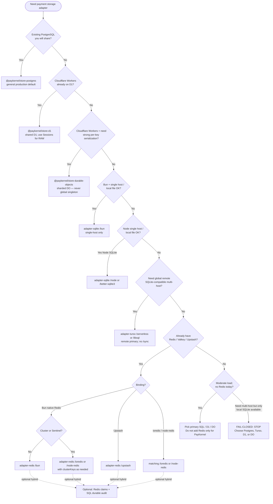

# Adapter selection guide (Phase 18)

**Audience:** application developers and coding agents (Codex).  
**Source of truth:** each package’s `StorageAdapterManifest` + shared testkit conformance suites — not marketing copy.

---

## 1) Purpose

Payment safety for this monorepo depends on **honest storage** for:

- **Idempotency** (reserve / complete with lease fencing)
- **Webhook inbox** (claim, lease, dual-mode processing)
- **Reconciliation** stores (lease-aware recovery work records)

Domain reconciliation primitives (safe lookup, decision-only policy, store-backed scheduler, `createPaymentReconciler`) live in [`@paykernel/reconciliation`](../packages/reconciliation/README.md) and inject any conforming `ReconciliationStore` from the adapters below — **no** mandatory queue product.

Choosing the wrong adapter (or overclaiming scope) creates silent cross-host races, lost audit rows, or false confidence after restart.

**Core honesty for every reader:**

| Fact | Implication |
| ---- | ----------- |
| **Redis is optional** | You do **not** need Redis to use `@paykernel/core` or the webhook engine. |
| **Local SQLite is single-host only** | Bun / Node / better-sqlite3 file DBs must not be used for multi-host coordination. |
| **Memory is NON-PRODUCTION** | `MEMORY_STORAGE_ADAPTER_MANIFEST` is test-only (`single-process` + `ephemeral`). |
| **Matrix cells must match manifests** | If a cell would overclaim, this guide uses the **weaker honest** value and names the limitation. |

Machine-readable guarantees live on each adapter’s manifest constant (validated by `assertStorageAdapterManifest` from `@paykernel/testkit`). Shared contract language: [packages/testkit/docs/store-contracts.md](../packages/testkit/docs/store-contracts.md) §7.

**Frozen selection matrix (tests + agents):**

- TypeScript: [`ADAPTER_SELECTION_MATRIX`](../packages/testkit/src/storage/adapter-selection-matrix.ts) in `@paykernel/testkit`
- JSON twin: [docs/adapter-capability-matrix.json](./adapter-capability-matrix.json)
- Live cross-check: [`scripts/check-adapter-selection-honesty.test.ts`](../scripts/check-adapter-selection-honesty.test.ts) (matrix cells vs each package’s `*STORAGE_ADAPTER_MANIFEST`)

---

## 2) Capability matrix

Columns align with the roadmap Phase 18 **Initial Matrix**, expanded with **package / subpath**.  
**Distributed** ≈ safe multi-worker coordination scope from `coordinationScope` (honest wording, not “multi-region” unless tested).  
**Durable audit** ≈ `durability` (rows/keys survive process restart under declared assumptions).  
**Atomic claim** ≈ `consistency.claims: "strong"` via engine-level ops (conditional SQL / Lua) — never get-then-set.

| Adapter | Package | Distributed | Durable audit | Atomic claim | Best use | Important limitation |
| ------- | ------- | ----------- | ------------- | ------------ | -------- | -------------------- |
| **PostgreSQL** | [`@paykernel/store-postgres`](../packages/store-postgres) | **Yes** (`multi-host`) | **Yes** (`durable`) | **Yes** (`strong`) | General production default when you already have (or will run) PostgreSQL | Needs managed/self-hosted DB; multi-primary without consensus is **out of scope** for this manifest |
| **Redis/Valkey** (Bun, ioredis, node-redis) | [`@paykernel/store-redis`](../packages/store-redis) subpaths `/bun`, `/ioredis`, `/node-redis` | **Yes** (`multi-host`), except **Bun: no Cluster/Sentinel** | **Configuration-dependent** (AOF/RDB / managed persistence) | **Yes** (atomic Lua) | Low-latency coordination, TTLs, lease claims | **Optional** infra; not automatic long-term audit alone; Bun rejects Cluster/Sentinel/`clusterKeys` |
| **Upstash Redis** | [`@paykernel/store-redis/upstash`](../packages/store-redis) | **Yes** (`multi-host`) | **Configuration-dependent** | **Yes** (server-side EVAL) | Serverless coordination / idempotency over HTTP REST | HTTP/network model + platform persistence policy must be understood; same hybrid-audit caveats as other Redis |
| **Bun SQLite** | [`@paykernel/store-sqlite/bun`](../packages/store-sqlite) | **No — single host** (`single-host`) | **Yes** with durable disk file (`durable`; `:memory:` is process-local) | **Yes** (`BEGIN IMMEDIATE` + conditional SQL) | Bun local / single-server apps | **Not** cross-host; no network FS sharing of the file |
| **Node SQLite** | [`@paykernel/store-sqlite/node`](../packages/store-sqlite) | **No — single host** | **Yes** (file-backed) | **Yes** | Node local / single server | `node:sqlite` stability varies by Node line (experimental); optional subpath only |
| **better-sqlite3** | [`@paykernel/store-sqlite/better-sqlite3`](../packages/store-sqlite) | **No — single host** | **Yes** (file-backed) | **Yes** | Mature Node SQLite deployments | Native dependency; synchronous API |
| **Turso serverless** | [`@paykernel/store-turso/serverless`](../packages/store-turso) | **Yes** (`multi-host` remote) | **Yes** (`durable`) | **Yes** after conformance (strong claims) | Shared remote SQLite-compatible store | Remote/async txn semantics; **not** local `adapter-sqlite`; **no** `/sync` export |
| **libSQL** | [`@paykernel/store-turso/libsql`](../packages/store-turso) | **Yes** remote multi-host; local `file:` is single-host testing only | **Yes** remote; local file follows SQLite file rules | **Yes** after conformance | Existing Turso / `@libsql/client` projects | Embedded-replica / offline multi-writer **not** advertised; no `/sync`; clients **not** interchangeable with `/serverless` |
| **Cloudflare D1** | [`@paykernel/store-d1`](../packages/store-d1) | **Yes** (`multi-host`, shared D1) | **Yes** (`durable`) | **Yes** (`strong` claims) | Worker-native shared relational store | **Not** local SQLite, Turso, or DO; `readAfterWrite: "session"`; `staleReadsPossible: true` without Sessions under read replication |
| **Cloudflare Durable Objects** | [`@paykernel/store-durable-objects`](../packages/store-durable-objects) | **Yes, partitioned** (`multi-host` + per-DO strong coordination) | **Yes** (SQLite-backed DO) | **Yes** within a partition | Strong **per-key / per-partition** coordination and retries | Requires sharding; **never** one global DO; no global total order across partitions; **not** D1/shared multi-primary SQL |
| **Memory (testkit)** ⚠️ | [`@paykernel/testkit`](../packages/testkit) | **No — single process** (`single-process`) | **No** (`ephemeral`) | Strong **only in one isolate** | Unit tests, local examples, conformance self-proof | **NON-PRODUCTION.** Never on a production payment path. Restart loses all state. |

### Manifest field cheat sheet (production adapters)

| Adapter | `coordinationScope` | `durability` | `consistency.claims` | `readAfterWrite` | `staleReadsPossible` |
| ------- | ------------------- | ------------ | -------------------- | ---------------- | -------------------- |
| postgres | `multi-host` | `durable` | `strong` | `strong` | `false` |
| redis (all bindings) | `multi-host` | `configuration-dependent` | `strong` | `strong` | `false` |
| sqlite (all bindings) | `single-host` | `durable` | `strong` | `strong` | `false` |
| turso (both bindings) | `multi-host` | `durable` | `strong` | `strong` | `false` |
| cloudflare-d1 | `multi-host` | `durable` | `strong` | **`session`** | **`true`** |
| cloudflare-do | `multi-host` (partitioned) | `durable` | `strong` | `strong` (per DO) | `false` (per partition) |
| memory | `single-process` | `ephemeral` | `strong` (isolate only) | `strong` | `false` |

**No published adapter declares `coordinationScope: "multi-region"`.** Do not invent multi-region strong consistency in product docs without tests and a matching manifest.

---

## 3) Decision tree

### 3.1 Mermaid flowchart

### 3.2 Numbered questions (same logic)

Answer in order; stop at the first clear fit.

1. **Do you already run PostgreSQL that all workers will share?**  
   → **`@paykernel/store-postgres`** (general production default).

2. **Cloudflare Workers and you already use D1 for this data plane?**  
   → **`@paykernel/store-d1`**. Prefer Sessions (`first-primary` / bookmarks) when read replication is on.

3. **Cloudflare Workers and you need strong per-key (per-partition) serialization / DO-native ops?**  
   → **`@paykernel/store-durable-objects`** with an explicit sharding strategy. **Never** route all payment work through one global Durable Object.

4. **Bun app, single host, durable local file is acceptable?**  
   → **`@paykernel/store-sqlite/bun`**.

5. **Node app, single host, local file OK?**  
   → **`/node`** or **`/better-sqlite3`** on `@paykernel/store-sqlite` (prefer better-sqlite3 until `node:sqlite` is stable for your line).

6. **Need multi-host remote SQLite-compatible storage (not a local file)?**  
   → **`@paykernel/store-turso`** (`/serverless` or `/libsql`). **Not** interchangeable with local SQLite or D1.

7. **Already operate Redis, Valkey, or Upstash for coordination?**  
   → Matching Redis binding; optionally **hybrid** with SQL for long-term audit ([hybrid-examples.md](../packages/store-redis/docs/hybrid-examples.md)).  
   - Bun + plain Redis URL → prefer **`/bun`**.  
   - Bun + **Cluster or Sentinel** → **do not use `/bun`**; use **`/ioredis`** or **`/node-redis`**.  
   - Upstash → **`/upstash`**.

8. **No Redis today and moderate load?**  
   → Pick the **primary** relational / D1 / DO adapter from above. **Do not add Redis** only because PayKernel exists.

**Fail-closed default:** if **multi-host** coordination is required and the only option under consideration is **local SQLite** (`adapter-sqlite` file DB) → **STOP**. Choose PostgreSQL, Turso (remote), D1, or Durable Objects (sharded). Do not “share the file” across hosts.

**Tests / examples only:** `createMemoryStores()` from `@paykernel/testkit` — **NON-PRODUCTION**.

---

## 4) Recommended defaults

Concrete package names matching the roadmap **Recommended Defaults**:

- **Existing PostgreSQL application** → [`@paykernel/store-postgres`](../packages/store-postgres)  
  Factories: `createPostgresStores` / binding helpers (`/pg`, `/postgres-js`, `/bun-sql`, `/drizzle`).
- **Cloudflare application already using D1** → [`@paykernel/store-d1`](../packages/store-d1)  
  Factory: `createD1PaymentStores({ db })` (+ explicit `migrateD1Adapter`).
- **Cloudflare application needing strong per-key coordination** → [`@paykernel/store-durable-objects`](../packages/store-durable-objects)  
  Factory: `createDoPaymentStores({ namespace, sharding })` — sharding required; never global/singleton default.
- **Bun single-server application** → [`@paykernel/store-sqlite/bun`](../packages/store-sqlite)  
  Factory: `createBunSqliteStores({ db })` (+ `migrateSqliteAdapter`, recommended pragmas).
- **Globally deployed app wanting remote SQLite compatibility** → [`@paykernel/store-turso`](../packages/store-turso)  
  Prefer `/serverless` or `/libsql` against a **shared remote** primary (not local file as multi-host).
- **Existing Redis or Valkey needing fast coordination** → [`@paykernel/store-redis`](../packages/store-redis) matching binding (`/bun`, `/ioredis`, `/node-redis`, or `/upstash`), **optionally paired** with SQL/D1/Turso for durable audit.
- **Bun application already using Redis or Valkey** → prefer **`@paykernel/store-redis/bun`** unless Cluster or Sentinel is required (then ioredis/node-redis).
- **No existing Redis and moderate workload** → prefer the **primary** relational / D1 / DO adapter above; **avoid adding Redis infrastructure** solely for this SDK.

---

## 5) Honesty / anti-marketing

Explicit bans for humans and coding agents:

| Do **not** market… | Because |
| ------------------ | ------- |
| Local SQLite (Bun / Node / better-sqlite3) as multi-host or multi-region | Manifest: `coordinationScope: "single-host"` only |
| Redis as required for PayKernel | Redis adapter is **optional**; many apps use SQL/D1/DO alone |
| D1 as interchangeable with local SQLite, Turso, or Durable Objects | Separate packages, APIs, and consistency models |
| Durable Objects as one global object or shared multi-primary SQL | Partitioned strong coordination only; sharding required |
| Multi-region strong consistency for any adapter | No adapter manifest uses `multi-region`; most are `multi-host` at most |
| Turso embedded-replica **`/sync`** | Package has **no** `./sync` export; offline multi-writer not advertised |
| Bun Redis Cluster / Sentinel support | `/bun` **rejects** Cluster/Sentinel; use ioredis/node-redis |
| Memory stores as production-safe | `single-process` + `ephemeral` — **NON-PRODUCTION** only |
| D1 strong read-after-write without sessions under replication | Manifest: `readAfterWrite: "session"`, `staleReadsPossible: true` |
| Redis as blindly durable audit storage | `durability: "configuration-dependent"`; hybrid SQL preferred for long-term audit |
| libSQL and Turso serverless clients as drop-in interchangeable | Different subpaths; test independently |

When uncertain: **fail closed** (weaker guarantee, or refuse the deployment shape) rather than invent capability.

---

## 6) Package quick reference

| npm package | Repo path | `coordinationScope` | Primary factory example | Docs |
| ----------- | --------- | ------------------- | ----------------------- | ---- |
| `@paykernel/store-postgres` | [`packages/store-postgres`](../packages/store-postgres) | `multi-host` | `createPostgresStores({ executor })` or `createPostgresStoresFromPg({ client })` | [README](../packages/store-postgres/README.md) · [overview](../packages/store-postgres/docs/overview.md) · [guarantees](../packages/store-postgres/docs/guarantees.md) · [crash-boundaries](../packages/store-postgres/docs/crash-boundaries.md) |
| `@paykernel/store-redis` | [`packages/store-redis`](../packages/store-redis) | `multi-host` | `createRedisStoresFromBun` / `FromIoredis` / `FromNodeRedis` / `FromUpstash` | [README](../packages/store-redis/README.md) · [overview](../packages/store-redis/docs/overview.md) · [guarantees](../packages/store-redis/docs/guarantees.md) · [crash-boundaries](../packages/store-redis/docs/crash-boundaries.md) · [hybrid](../packages/store-redis/docs/hybrid-examples.md) |
| `@paykernel/store-sqlite` | [`packages/store-sqlite`](../packages/store-sqlite) | `single-host` | `createBunSqliteStores({ db })` / Node / better-sqlite3 counterparts | [README](../packages/store-sqlite/README.md) · [overview](../packages/store-sqlite/docs/overview.md) · [guarantees](../packages/store-sqlite/docs/guarantees.md) · [deployment-limits](../packages/store-sqlite/docs/deployment-limits.md) · [crash-boundaries](../packages/store-sqlite/docs/crash-boundaries.md) |
| `@paykernel/store-turso` | [`packages/store-turso`](../packages/store-turso) | `multi-host` | `createTursoServerlessStores` / `createLibsqlStores` (+ `migrateTursoAdapter`) | [README](../packages/store-turso/README.md) · [overview](../packages/store-turso/docs/overview.md) · [guarantees](../packages/store-turso/docs/guarantees.md) · [embedded-replicas](../packages/store-turso/docs/embedded-replicas.md) · [crash-boundaries](../packages/store-turso/docs/crash-boundaries.md) |
| `@paykernel/store-d1` | [`packages/store-d1`](../packages/store-d1) | `multi-host` | `createD1PaymentStores({ db: env.PAYMENTS_DB })` | [README](../packages/store-d1/README.md) · [overview](../packages/store-d1/docs/overview.md) · [guarantees](../packages/store-d1/docs/guarantees.md) · [sessions](../packages/store-d1/docs/sessions-and-replication.md) · [crash-boundaries](../packages/store-d1/docs/crash-boundaries.md) |
| `@paykernel/store-durable-objects` | [`packages/store-durable-objects`](../packages/store-durable-objects) | `multi-host` (partitioned) | `createDoPaymentStores({ namespace, sharding })` | [README](../packages/store-durable-objects/README.md) · [overview](../packages/store-durable-objects/docs/overview.md) · [guarantees](../packages/store-durable-objects/docs/guarantees.md) · [sharding](../packages/store-durable-objects/docs/sharding.md) · [crash-boundaries](../packages/store-durable-objects/docs/crash-boundaries.md) |
| `@paykernel/testkit` (memory) | [`packages/testkit`](../packages/testkit) | `single-process` | `createMemoryStores()` | [store-contracts §7](../packages/testkit/docs/store-contracts.md) · `MEMORY_STORAGE_ADAPTER_MANIFEST` |

Manifest constants (importable where exported):

| Constant | Package |
| -------- | ------- |
| `POSTGRES_STORAGE_ADAPTER_MANIFEST` | `@paykernel/store-postgres` |
| `REDIS_STORAGE_ADAPTER_MANIFEST` | `@paykernel/store-redis` |
| `SQLITE_STORAGE_ADAPTER_MANIFEST` | `@paykernel/store-sqlite` |
| `TURSO_STORAGE_ADAPTER_MANIFEST` | `@paykernel/store-turso` |
| `D1_STORAGE_ADAPTER_MANIFEST` | `@paykernel/store-d1` |
| `DO_STORAGE_ADAPTER_MANIFEST` | `@paykernel/store-durable-objects` |
| `MEMORY_STORAGE_ADAPTER_MANIFEST` | `@paykernel/testkit` |

Helpers: `assertStorageAdapterManifest`, `isProductionSafeCoordination`, `isStrongClaimAdapter` from `@paykernel/testkit`.

---

## 7) Related docs

| Document | Why |
| -------- | --- |
| [docs/monorepo.md](./monorepo.md) | Workspace layout, package list, DX commands |
| [docs/workspace-boundaries.md](./workspace-boundaries.md) | What may depend on what (no core → adapter edges) |
| [docs/releases.md](./releases.md) | Changesets / publish policy |
| [docs/adapter-capability-matrix.json](./adapter-capability-matrix.json) | Machine-readable Phase 18 matrix (frozen honesty cells) |
| [packages/testkit/docs/store-contracts.md](../packages/testkit/docs/store-contracts.md) | Phase 9 lease-aware contracts + **§7 manifests** |
| [roadmap.md](../roadmap.md) Phase 9 | Store contracts foundation |
| [roadmap.md](../roadmap.md) Phase 11 | Internal SQL foundation (`internal/sql-store`) |
| [roadmap.md](../roadmap.md) Phases 12–17 | Postgres → Redis → SQLite → Turso → D1 → DO adapter deliveries |
| [roadmap.md](../roadmap.md) Phase 18 | This matrix + selection guide (objective / acceptance) |
| Root [README.md](../README.md) | Install table and honesty banners for each adapter package |

---

## Codex / agent checklist

When recommending an adapter:

1. State **package name + subpath** (if any).
2. State **`coordinationScope` and `durability`** from the manifest, not assumptions.
3. For multi-host need + local SQLite only → **refuse** and offer Postgres / Turso / D1 / DO.
4. For Redis → say **optional**; mention Bun Cluster/Sentinel rejection when relevant.
5. For D1 → mention **session** RAW / stale-read caveat under replication.
6. For DO → require **sharding**; forbid global singleton.
7. For Turso → **no `/sync`**; remote multi-host ≠ local SQLite.
8. Never recommend **memory** for production paths.
